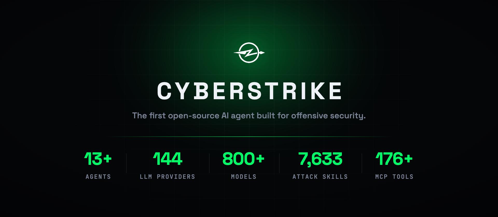

<p align="center">
  <a href="README.md">English</a> |
  <a href="README.zh.md">简体中文</a> |
  <a href="README.zht.md">繁體中文</a> |
  <a href="README.ko.md">한국어</a> |
  <a href="README.de.md">Deutsch</a> |
  <a href="README.es.md">Español</a> |
  <a href="README.fr.md">Français</a> |
  <a href="README.it.md">Italiano</a> |
  <a href="README.da.md">Dansk</a> |
  <a href="README.ja.md">日本語</a> |
  <a href="README.pl.md">Polski</a> |
  <a href="README.ru.md">Русский</a> |
  <a href="README.bs.md">Bosanski</a> |
  <a href="README.ar.md">العربية</a> |
  <a href="README.no.md">Norsk</a> |
  <a href="README.br.md">Português (Brasil)</a> |
  <a href="README.th.md">ไทย</a> |
  <a href="README.tr.md">Türkçe</a> |
  <a href="README.uk.md">Українська</a> |
  <a href="README.bn.md">বাংলা</a> |
  <a href="README.el.md">Ελληνικά</a> |
  <a href="README.vi.md">Tiếng Việt</a> |
  <a href="README.hi.md">हिन्दी</a>
</p>

<p align="center">
  <picture>
    <source media="(prefers-color-scheme: dark)" srcset="assets/hero-dark.webp">
    <source media="(prefers-color-scheme: light)" srcset="assets/hero-light.webp">
    
  </picture>
</p>

<h3 align="center">Saldiri guvenlik icin insa edilmis ilk acik kaynakli yapay zeka ajani.</h3>

<p align="center">
  Terminalinizden otonom sizma testi — kesif, zafiyet tespiti, istismar ve raporlama.<br>
  Tek komut. 13+ uzman ajan. 120+ OWASP test senaryosu. Yapay zeka kirmizi takim.
</p>

<p align="center">
  <a href="#neden-cyberstrike">Neden CyberStrike?</a> &bull;
  <a href="#farki-ne">Farki Ne?</a> &bull;
  <a href="#ajanlar">Ajanlar</a> &bull;
  <a href="#mcp-ekosistemi">MCP Ekosistemi</a> &bull;
  <a href="#bolt">Bolt</a> &bull;
  <a href="#kurulum">Kurulum</a> &bull;
  <a href="#yerlesik-araclar">Yerlesik Araclar</a> &bull;
  <a href="#kimler-icin">Kimler Icin?</a> &bull;
  <a href="CHANGELOG.md">Changelog</a> &bull;
  <a href="CONTRIBUTING.md">Contributing</a>
</p>

<p align="center">
  <a href="https://www.npmjs.com/package/@cyberstrike-io/cyberstrike"></a>
  <a href="https://github.com/CyberStrikeus/CyberStrike/actions/workflows/publish.yml"></a>
  <a href="https://discord.gg/snunAaHf6U"></a>
  <a href="https://github.com/CyberStrikeus/CyberStrike/blob/dev/LICENSE"></a>
</p>

---

### Neden CyberStrike?

Guvenlik testleri hala buyuk olcude manuel yapiliyor. Sizma testcileri duzinelerce arac arasinda gidip geliyor, terminal ciktilarini kopyala-yapistir ile aktariyor ve asil saldiri yuzeyine dokunmadan once tekrarlayan kesif islemleriyle saatler harciyor. Bug bounty avcilari her program icin ayni kesif is akisina zaman ayirmak zorunda kaliyor.

**CyberStrike bunu degistiriyor.** Saldiri guvenlik metodolojisini anlayan otonom bir yapay zeka ajanidir — sadece arac calistirmakla kalmaz, neyi test etmesi gerektigini dusunur, bulgulari birbirine zincirlemeyi bilir ve kesfettiklerine gore yaklasimini uyarlar. Terminalinizde yorulmak bilmeyen bir kirmizi takim uyesi olarak dusunun — OWASP WSTG'yi takip eder, ne zaman yon degistirecegini bilir ve isi bittiginde raporu yazar.

```bash
npm i -g @cyberstrike-io/cyberstrike@latest && cyberstrike
# "https://hedef.com uzerinde tam OWASP WSTG degerlendirmesi calistir"
```

Acik kaynaklidir, herhangi bir LLM saglayicisiyla calisir ve urettigi her sey size aittir.

---

### Farki Ne?

<table>
<tr>
<td width="50%">

**Genel Sohbet Degil, Uzmanlasmis Guvenlik Ajanlari**

CyberStrike, guvenlik alanlari icin ozel olarak tasarlanmis 13+ ajanla gelir. Her ajan alana ozgu metodoloji, arac bilgisi ve test kaliplari tasir. Web uygulamasi ajani WSTG'yi takip eder. Bulut guvenligi ajani CIS kiyaslamalarini bilir. Mobil ajani Frida kullanir ve MASTG/MASVS standartlarina uyar. Tahmin yurutmezler — kanitlanmis cercelveleri uygularlar.

</td>
<td width="50%">

**Sadece Yardimci Degil, Otonom**

Diger yapay zeka araclari siradaki ne yapacaginizi soylemenizi bekler. CyberStrike ajanlari cok adimli saldiri zincirleri planlar, araclari calistirir, sonuclari analiz eder, ilginc bir sey buldugunda yon degistirir ve kanitlarla desteklenen raporlar uretir. Siz hedefi belirlersiniz — metodolojiyi onlar yurutur.

</td>
</tr>
<tr>
<td width="50%">

**Herhangi Bir LLM, Bagimlilik Yok**

Kutudan ciktigi gibi 15+ saglayici: Anthropic, OpenAI, Google, Amazon Bedrock, Azure, Groq, Mistral, OpenRouter — hatta OpenAI uyumlu uc noktalar araciligiyla yerel modeller bile. Claude, GPT, Gemini veya kendi barindiginiz LLM ile calistirin. Modeller iyilestikce ve ucuzladikca, CyberStrike de onlarla birlikte gelisir.

</td>
<td width="50%">

**Bolt ile Uzaktan Arac Calistirma**

Guvenlik araclarinizin dizustu bilgisayarinizda calismasi gerekmez. Bolt, CyberStrike'in uzak arac sunucusudur — sizma testi arac setinizle bir VPS'e kurun, Ed25519 anahtarlariyla eslestirin ve MCP protokolu uzerinden her seyi yerel terminalinizden kontrol edin. Tek arayuz, birden fazla saldiri sunucusu.

</td>
</tr>
</table>

---

### Ajanlar

Ajanlar arasinda `Tab` ile gecis yapin. Her biri bir uzmandir.

| Ajan                   | Odak  | Ne Yapar                                                                         |
| ---------------------- | ----- | -------------------------------------------------------------------------------- |
| **cyberstrike**        | Genel | Tam erisimli birincil ajan — kesif, istismar, raporlama                          |
| **web-application**    | Web   | OWASP Top 10, WSTG metodolojisi, API guvenligi, oturum testi                     |
| **mobile-application** | Mobil | Android/iOS, Frida/Objection, MASTG/MASVS uyumlulugu                             |
| **cloud-security**     | Bulut | AWS, Azure, GCP — IAM yanlis yapilandirmalari, CIS kiyaslamalari, acik kaynaklar |
| **internal-network**   | Ag    | Active Directory, Kerberos saldirilari, yanal hareket, pivotlama                 |

Ayrica hedefli zafiyet siniflari icin trafigi yakalayip manipule eden **8 uzmanlasmis proxy test ajani**:

`IDOR` · `Authorization Bypass` · `Mass Assignment` · `Injection` · `Authentication` · `Business Logic` · `SSRF` · `File Attacks`

---

### MCP Ekosistemi

CyberStrike, yeteneklerini genisleten uzmanlasmis MCP sunucularina baglanir:

| Sunucu                                                                 | Arac | Ne Ekler                                                              |
| ---------------------------------------------------------------------- | ---- | --------------------------------------------------------------------- |
| [cloud-audit-mcp](https://github.com/badchars/cloud-audit-mcp)         | 38   | Bulut guvenlik denetimleri — AWS, Azure, GCP genelinde 60+ kontrol    |
| [github-security-mcp](https://github.com/badchars/github-security-mcp) | 39   | GitHub guvenlik durusu — repo, org, actions, secrets, tedarik zinciri |
| [cve-mcp](https://github.com/badchars/cve-mcp)                         | 23   | CVE istihbarati — NVD, EPSS, CISA KEV, GitHub Advisory, OSV           |
| [osint-mcp](https://github.com/badchars/osint-mcp)                     | 37   | OSINT kesfi — Shodan, VirusTotal, SecurityTrails, Censys, DNS, WHOIS  |

Hepsi acik kaynak. Hepsi `npx` ile kurulabilir. CyberStrike'a baglayin veya herhangi bir MCP istemcisiyle bagimsiz kullanin.

---

### Bolt

Bolt, CyberStrike'in uzaktan arac calistirma sunucusudur. Guvenlik araclarini dizustu bilgisayarinizda calistirmak yerine, bunlari bir VPS'e (veya birden fazlasina) kurun ve her seyi yerel terminalinizden kontrol edin.

```
┌──────────────┐         MCP Protocol         ┌──────────────────┐
│  Your Laptop │  ◄──── Ed25519 Auth ────►    │  VPS / Cloud     │
│  CyberStrike │         over HTTPS           │  Bolt Server     │
│  TUI         │                               │  nmap, nuclei,   │
│              │  ◄──── Tool Results ────►     │  sqlmap, ffuf...  │
└──────────────┘                               └──────────────────┘
```

**Nasil calisir:**

- Bolt'u sizma testi arac setinizin yuklu oldugu herhangi bir sunucuya kurun
- Ed25519 anahtarlariyla eslestirin — sifre yok, paylasilan sir yok
- CyberStrike ajanlari araclari MCP protokolu uzerinden uzaktan cagirir
- Sonuclar yerel TUI'nize gercek zamanli olarak akar
- Baglantilari TUI'den yonetin: ekleme, kaldirma, durum izleme

**Neden onemli:** Saldiri yuzeyiniz ozel altyapida kalir. Daha iyi bant genisligine sahip bir VPS'ten agir taramalar calistirin, araclari tek bir yerde guncel tutun ve tek bir terminalden birden fazla saldiri sunucusu arasinda gecis yapin.

---

### Kurulum

```bash
# npm / bun / pnpm / yarn
npm i -g @cyberstrike-io/cyberstrike@latest

# macOS
brew install CyberStrikeus/tap/cyberstrike

# Windows
scoop install cyberstrike

# curl (Linux/macOS)
curl -fsSL https://cyberstrike.io/install.sh | bash
```

**Masaustu uygulamasi** (macOS, Windows, Linux) — [surumler sayfasindan](https://github.com/CyberStrikeus/CyberStrike/releases) indirin veya:

```bash
brew install --cask cyberstrike-desktop          # macOS
scoop bucket add extras; scoop install extras/cyberstrike-desktop  # Windows
```

---

### Yerlesik Araclar

CyberStrike ajanlari 30+ araca dogrudan erisim saglar:

| Kategori        | Araclar                                                    |
| --------------- | ---------------------------------------------------------- |
| **Calistirma**  | Shell (bash), dosya okuma/yazma/duzenleme, dizin listeleme |
| **Kesif**       | Web getirme, web aramasi, kod aramasi, glob, grep          |
| **Guvenlik**    | Zafiyet raporlama (HackerOne formati), kanit toplama       |
| **Proxy**       | HTTP/HTTPS yakalama, istek tekrarlama, trafik analizi      |
| **Entegrasyon** | MCP sunuculari, Bolt uzak araclari, ozel eklentiler        |

Ayrica bir **eklenti SDK'si** — kendi ajanlarinizi ve araclarinizi olusturun, calisma zamaninda kaydedin.

---

### Kimler Icin?

- **Sizma Testcileri** — Tekrarlayan isleri otomatiklestirin. Ajanlar kesif ve ilk testleri hallederken siz insan sezgisi gerektiren yaratici saldiri zincirlerine odaklanin.
- **Bug Bounty Avcilari** — Daha hizli kesif, daha genis kapsam, programlar arasi tutarli metodoloji. CyberStrike gece 3'te yorulmaz.
- **Guvenlik Ekipleri** — Tekrarlanabilir metodolojiyle yapilandirilmis OWASP degerlendirmeleri calistirin. Uyumluluk ekibinizin anlayacagi standartlarla eslesen raporlar alin.
- **Guvenlik Arastirmacilari** — Ozel ajanlar ve MCP sunuculariyla CyberStrike'i genisletin. Eklenti sistemi ve MCP protokolu onu sadece bir arac degil, bir platform yapar.

---

### Katkida Bulunma

CyberStrike, guvenlik toplulugu tarafindan, guvenlik toplulugu icin insa edilmistir. Su alanlarda katkilari memnuniyetle karsiliyoruz:

- **Guvenlik ajanlari ve yetenekler** — Yeni saldiri metodolojileri, test kaliplari, zafiyet tespiti
- **MCP sunuculari** — Yeni guvenlik araclari ve veri kaynaklari baglantisi
- **Bilgi tabani** — WSTG, MASTG, PTES, CIS metodoloji kilavuzlari
- **Cekirdek iyilestirmeler** — Performans, kullanici deneyimi, saglayici entegrasyonlari, hata duzeltmeleri

PR gondermeden once [Katkida Bulunma Kilavuzu](./CONTRIBUTING.md)'nu okuyun. Tum katkilar projenin [etik kullanim politikasina](./CODE_OF_CONDUCT.md) uymalidir — CyberStrike yalnizca yetkili guvenlik testleri icindir.

---

### Lisans

[AGPL-3.0-only](./LICENSE) — Kisisel ve acik kaynak kullanim icin ucretsizdir. Ticari lisanslama icin [contact@cyberstrike.io](mailto:contact@cyberstrike.io) ile iletisime gecin.

---

### MCP Security Suite

CyberStrike is the core platform. These MCP servers extend its capabilities:

| Project                                                                | Domain                                  | Tools                                 |
| ---------------------------------------------------------------------- | --------------------------------------- | ------------------------------------- |
| **CyberStrike**                                                        | **Autonomous offensive security agent** | **13+ agents, 120+ OWASP test cases** |
| [cloud-audit-mcp](https://github.com/badchars/cloud-audit-mcp)         | Cloud security (AWS/Azure/GCP)          | 38 tools, 60+ checks                  |
| [github-security-mcp](https://github.com/badchars/github-security-mcp) | GitHub security posture                 | 39 tools, 45 checks                   |
| [cve-mcp](https://github.com/badchars/cve-mcp)                         | Vulnerability intelligence              | 23 tools, 5 sources                   |
| [osint-mcp](https://github.com/badchars/osint-mcp-server)              | OSINT & reconnaissance                  | 37 tools, 12 sources                  |

---

<p align="center">
  <a href="https://discord.gg/snunAaHf6U"><b>Discord</b></a> · <a href="https://x.com/cyberstrike"><b>X.com</b></a> · <a href="https://cyberstrike.io"><b>cyberstrike.io</b></a>
</p>
<p align="center">
  <sub>Terminaller arasinda kopyala-yapistir yapmaktan bikan hackerlar tarafindan insa edildi.</sub>
</p>
